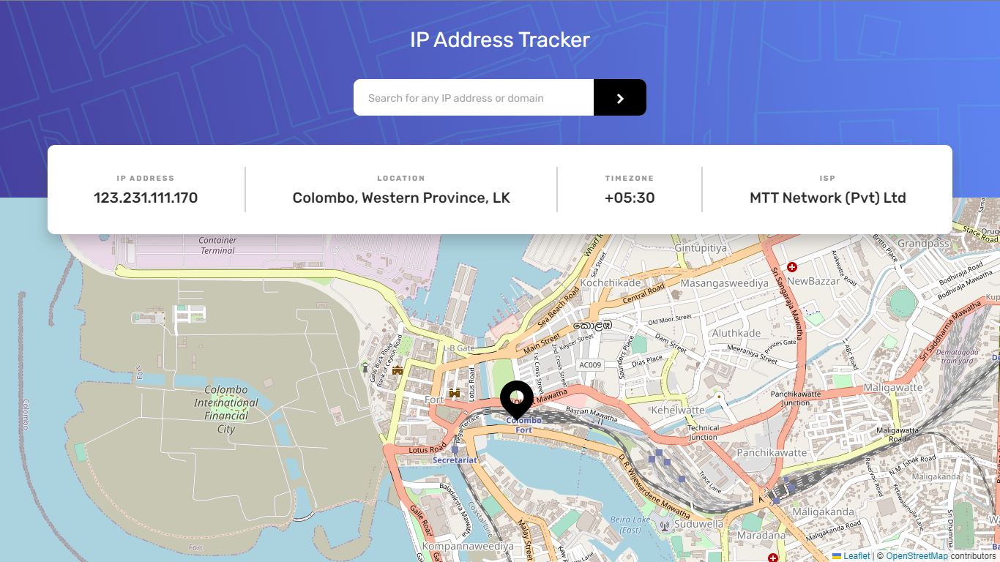

# Frontend Mentor - IP Tracker solution

This is a solution to the [IP Address Tracker challenge on Frontend Mentor](https://www.frontendmentor.io/challenges/ip-address-tracker-I8-0yYAH0).

## Table of contents

- [Overview](#overview)
  - [The challenge](#the-challenge)
  - [User Interface](#user-interface)
  - [Links](#links)
- [My process](#my-process)
  - [Built with](#built-with)
  - [What I learned](#what-i-learned)
  - [Continued development](#continued-development)
  - [Useful resources](#useful-resources)
- [Author](#author)
- [Acknowledgments](#acknowledgments)

## Overview

### The challenge

Users should be able to:

- View the optimal layout for the site depending on their device's screen size.(Challenge intendeds for Mobile and Desktop devices only.)
- See hover states for all interactive elements on the page.
- See their own IP Address on the map on the initial page load.
- Search for any IP addresses or domains and see the key information and location.

### User Interface



### Links

- Solution URL: [Click here](https://e-commerce-product-page-gamma.vercel.app/)
- Live Site URL: [Click here](https://ip-tracker-pi-orpin.vercel.app/)

## My process

### Built with

- Semantic HTML5 markup
- CSS custom properties
- Bootstrap grid
- Flexbox
- CSS Grid
- JavaScrit/Jquery
- Leaflet JS Map Library
- Ipify IP Geolocation API

### What I learned

When developing this IP Address Tracker website project, these are new things, I have learned.

-How website frontend connect with an API service.
-This is my very first experience with Leaflet JS and Ipify Geolocation API. So, the first thing I leaned during this project period is the ease of the Leaflet JS library rather than using Google Maps. Correct me if I'm wrong. But I think for small purposes related projects, Leaflet JS is far more suitable option.

-During this project, I noticed something unusual about innerHTML. I have added some code snippets below for anyone who reads this.
```JS example 1
var ipOutAdd = document.getElementById("ip-add").innerHTML;

function(){
  $.ajax({
            url: "https://geo.ipify.org/api/v1",
            data: { apiKey: apikey, ipAddress: ipAdd.value },
            success: function (data) {

                ipOutAdd = data.ip;

                map.setView([data.location.lat, data.location.lng]);
                L.marker([data.location.lat, data.location.lng], { icon: locIcon }).addTo(map);
            }
        });
}
```

**Explanation** : Declaring variable with innerHTML property, doesn't let change the value of the HTML tag from inside the function. Insted of that, I changed the innerHTML property position & it worked like a charm.

```JS example 2
var ipOutAdd = document.getElementById("ip-add");

function(){
  $.ajax({
            url: "https://geo.ipify.org/api/v1",
            data: { apiKey: apikey, ipAddress: ipAdd.value },
            success: function (data) {

                ipOutAdd.innerHTML = data.ip;

                map.setView([data.location.lat, data.location.lng]);
                L.marker([data.location.lat, data.location.lng], { icon: locIcon }).addTo(map);
            }
        });
}
```
**Explanation** : Adding innerHTML property inside the function with declared variable is the solution for that issue. I don't know the exact reason. As far as I know, above both code snippets are to implement the same functionality.


### Continued development

- Currently, this program accepts IP Addresses only. So, I need to add Domain name functionality too and will be done in future.

### Useful resources

- [Siphiwo Julayi | YouTube Video](https://youtu.be/vidOkPR75qE) - I found this YouTube video when trying to find some help through the internet.
- [Siphiwo Julayi | GitHub Repo](https://github.com/Siphiwo/ip-address-tracker-tutorial) - This is the GitHub repo of the above YouTube video. I didn't copy his code but his code helped me a lot when coding the API calling section.

## Author

- Website - [TIDEV](https://www.tidev.one)
- Frontend Mentor - [@T-Induwara](https://www.frontendmentor.io/profile/T-Induwara)
- Github - [@T-Induwara](https://github.com/T-Induwara)
- LinkedIn - [@t-induwara](https://www.linkedin.com/in/t-induwara/)

## Acknowledgments

I want to give thanks specially to [Siphiwo Julayi | GitHub Repo](https://github.com/Siphiwo/ip-address-tracker-tutorial) for showing me the write way to call API and data retrival methods.
